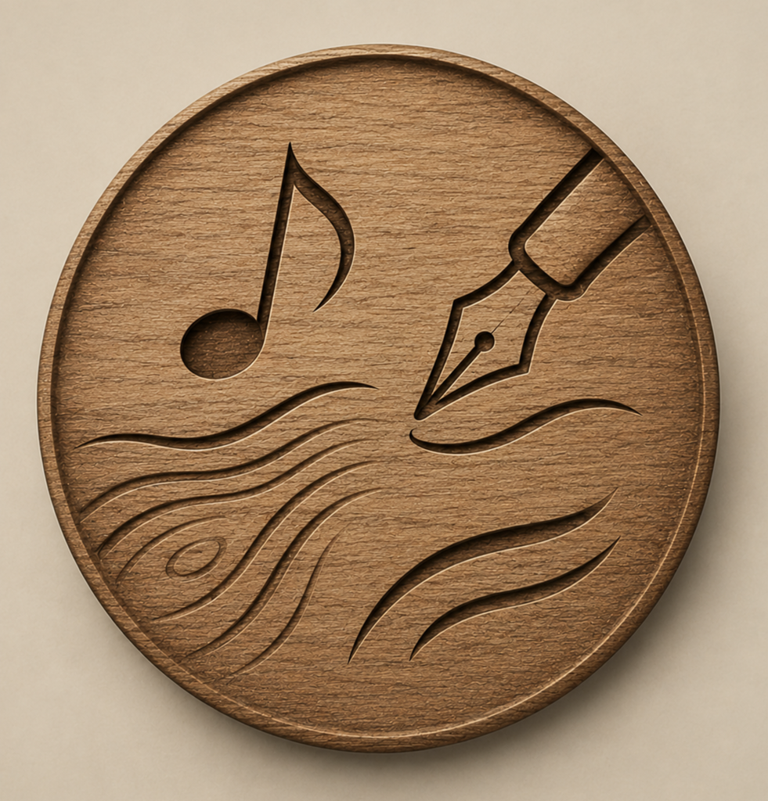

# Gobo26

  

Gobo26 és un petit taller digital en català: jocs, eines, aventures interactives i aplicacions personals fetes amb cura, pensades per servir sense presses.

Web: https://gobo26.github.io/gobo26/

## Projectes principals

### Gobo26 · Aplicacions

Col·lecció de jocs i eines web: paraules, números, memòria, lògica, salut, música i petites utilitats per al dia a dia.

Repo: https://github.com/Gobo26/gobo26

### Taller de Lletres

Espai per a poemes, cançons, textos breus i fragments de vida.

Repo: https://github.com/Gobo26/Taller_de_lletres

### Textos26

Arxiu personal de textos, emocions i materials literaris.

Repo: https://github.com/Gobo26/Textos26

### Fustaventura

Espai reservat per a una nova línia creativa: aventures, narració, música, fusta, camins i imaginació artesanal. El logo de fusta amb ploma i nota musical queda com a primera peça d'identitat visual del projecte.

Repo: https://github.com/Gobo26/fustaventura

## Què hi ha

- Jocs de paraules, memòria, números i lògica.
- Aventures interactives i petits reptes narratius.
- Eines personals per al dia a dia.
- Recursos creatius i literaris.
- Un espai nou per fer créixer Fustaventura.

## Filosofia

El projecte busca eines senzilles, properes i gratuïtes. Algunes aplicacions són experiments, altres són més madures, però totes formen part d'un mateix taller digital: provar idees, aprendre i millorar-les a poc a poc.

## Privacitat

Les aplicacions que guarden informació ho fan al navegador del dispositiu, habitualment amb `localStorage`. No hi ha servidor propi ni base de dades remota, però cal tenir cura si es fan servir en dispositius compartits o si s'exporten fitxers amb dades personals.

## Estat

Projecte viu i en evolució. Les aplicacions es revisen progressivament per millorar-ne l'estètica, accessibilitat, claredat i experiència d'ús.
